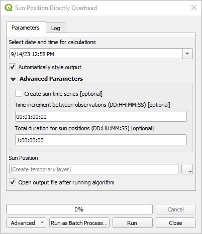
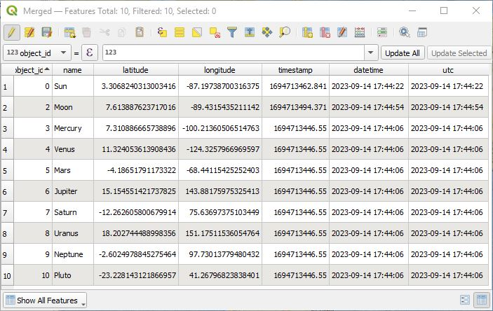
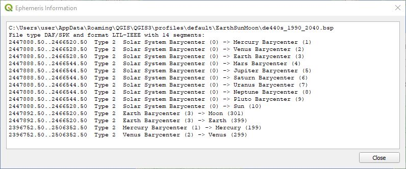

# Earth, Sun, Moon, and Planets Plugin

This plugin uses the highly accurate Skyfield library to show where the sun, moon, and planets are located at their zenith from earth's perspective for a particular date and time. An additional algorithm calculates lunar and solar data for a particular location on earth given a date and time. The ***Day/Night terminator*** algorithm plots the day/night terminator line and polygon layers associated with sunrise/sunset, civil twilight, nautical twilight, and astronomical twilight. It includes Field Calculator expressions which give access to solar and lunar information. When installed, this plugin can be found in the QGIS menu under ***Plugins->Earth, sun, moon &amp; planets***. 

## Installation
This plugin can be enhanced with two additional python libraries not provided by QGIS. Without the extra libraries only the ***Day/Night terminator*** and ***Sun position directly overhead*** algorithms will be available. These libraries can be installed by running the OSGeo4W Shell and typing the command "**pip install timezonefinder skyfield**" or whatever method you use to install Python libraries.

You do not need to be a system administrator to be able to install these libraries. If these libraries are not installed then the functionality will be limited to the following two capabilities.

## Tools Overview

These are the tools provided by the Earth, Sun, Moon, and Planets Plugin:

*  ***Day/Night terminator*** - This algorithm creates vector layers for the day/night terminator line, polygon layers associated with sunrise/sunset, civil twilight, nautical twilight and astronomical twilight, and the position of the sun directly overhead. Unlike the other algorithms below this does not depend on the Skyfield library. It uses spherical geometry like the web based maps that you find on-line.
*  ***Sun position directly overhead*** - This shows the location of the sun where it is directly overhead for a particular date and time. If the Skyfield library is not installed, then this algorithm uses a slightly less accurate spherical calculation for the sun's position.
*  ***Moon position directly overhead*** - This shows the location of the moon where it is directly overhead for a particular date and time.
*  ***Planetary positions directly overhead*** - This shows the location of the planets where they are directly overhead for a particular date and time.
*  ***Ephemeris information*** - This provides information about the selected ephemeris file. This plugin includes limited ephemeris data for the dates 1990-2040. For dates outside this range other ephemeris files can be downloaded from the <a href="https://naif.jpl.nasa.gov/pub/naif/generic_kernels/spk/planets/">JPL Ephemeris page</a>. These can be installed from the ***Settings*** menu.
*  ***Settings*** - Plugin settings.

## Field Calculator Expressions

The following expressions are available in the field calculator. Note that the expressions require the Skyfield library.

* ***esm_local_datetime()*** - Returns the current date and time as a python datetime object with the local computer's timezone settings.
* ***esm_local_qdatetime()*** - Returns the current date and time as a standard QGIS QDateTime object with the local computer's timezone settings. 
* ***esm_moon_phase()*** - Given a date and time, return the moon's phase in degrees where 0° is the New Noon, 90° is First Quarter, 180° is Full Moon, and 270° is Last Quarter.
* ***esm_moon_zenith()*** - Given a date and time, return the EPSG:4326 coordinate point where the moon is directly overhead. 
* ***esm_sun_moon_info()*** - Given a date and time, latitude and longitude in EPSG:4326, output format type, and optional timezone of the date and time object, it returns a python dictionary or JSON string of solar and lunar information.
* ***esm_sun_zenith()*** - Given a date and time, return the EPSG:4326 coordinate point where the sun is directly overhead.

##  Day/Night terminator

This algorithm creates vector layers for the position of the sun directly overhead, day/night terminator line, and polygon layers associated with sunrise/sunset, civil twilight, nautical twilight and astronomical twilight. This is the associated dialog box.

The input parameters are as follows:

* ***Set date and time*** - This will automatically be initialized to the current date, time, and timezone of your computer. Internally it converts the date and time to UTC for all the calculations.
* ***Show sun position*** - This will create a point for the position of the sun where it is directly overhead.
* ***Show day/night terminator line*** - This is the terminating vector line representing the boundary between sunrise and sunset.
* ***Sunrise, Sunset*** - This is a polygon of the day/night, sunrise/sunset dark region.
* ***Civil Twilight*** - This is a polygon of the civil twilight region.
* ***Nautical Twilight*** - This is a polygon of the nautical twilight region.
* ***Astronomical Twilight*** - This is a polygon of the astronomical twilight region.
* ***Delta/resolution of polygon*** - This determines the number of points used to create the lines and polygons. A larger number means fewer points and less accuracy. The default value of 1.0 probably does not need to be changed in most instances.
* ***Add solar disk diameter for day/night terminator calculation*** - The sun is not a point but a disk and this compensates for the day/night terminator with a refraction index of 0.833. Should you check this box? It really depends on your definition of the day/night terminator line. By default it is not checked.
* ***Automatically style output*** - When checked, the resulting output layers are nicely styled.
* ***Clip polygons to project CRS bounds*** - The output vector layer's coordinate reference is EPSG:4326 with longitude going from -180 to 180 degrees and latitude from -90 to 90 degrees. If you are using some other CRS and this is checked, then the resulting layers will be clipped to the project CRS.

Here is an example of what is generated with automatic styling.

The attribute tables give the name of the feature, its computer date and time, and the UTC string of the date and time.

##  Sun position directly overhead

This shows the dialog for the algorithm to calculate the sun directly overhead. If the Skyfield library is installed then it uses the highly accurate position algorithms of the library; otherwise, it uses a spherical earth model. The time zone of the date and time is based on the time zone of the computer you are running QGIS on. Internally, the dates and times are converted to UTC.

If ***Advanced Paramters*** is expanded and ***Create sun time series*** is checked, then a series of sun observations is created starting from the date and time specified with each successive date and time incremented using ***Time increment between observations*** until the ***Total duration for sun positions*** is reached. Be carefult that the time increment is not to small for the duration desired. There is the potential to create a huge number of sun date &amp; time points. The time increment and total duration is in the form of DD:HH:MM:SS where DD represents days, HH hours, MM minutes, and SS seconds. You don't need to have all the ending times, but you need all the beginning ones. For an example you could do something like **1:26.5** representing 1 day and 26.5 hours which is really 2 days and 2.5 hours. Note that the days, hours, minutes and seconds are not constrained in their size. The time series can be animated with the QGIS time controller or with the QTDC plugin. Here is an example of the resulting image using the default settings.

This shows what this algorithm produces when this algorithm is run for both the sun and moon not using a time series.

The planets algorithm currently does not have the option for a time series. This shows the results of running the alogirthms to locate the sun, moon, and planets for a certain date and time.

The attribute table contains the object id, name of the object, its coordinate where it is directly overhead, and the date and time as a time stamp and computer time and UTC date, time strings. This is the attribute table with all three combined together.

##  Solar/lunar information

The user can click on the  coordinate capture icon and click on the map. This dialog is then populated with the following details. The timezone is automatically selected based on the coordinate.

The ***Now*** icon  will set the date and time to the current computer time. The ***Use UTC*** check box displays the date and times in UTC; otherwise, they are displayed using the selected time zone.

##  Ephemeris Information
This tool displays information about the selected ephemeris file being used. Here is the limited extract file ***de440s_1990_2040.bsp*** that comes with the plugin.

##  Settings

This shows the settings dialog window. 

It allows the user to select the ephemeris file used in the calculations. Click on the drop down box to select the ephemeris file to use. When first installed the plugin only includes a single limited ephemeris data extract between the years 1990 and 2040 so there will only be one option. A full ephemeris file exceeds the allowed QGIS plugin size. For dates outside this range other ephemeris files can be downloaded from the <a href="https://naif.jpl.nasa.gov/pub/naif/generic_kernels/spk/planets/">JPL Ephemeris page</a>. Once one of these are downloaded, click on the "**...**" button and select the downloaded **.bsp** then click on the ***Install Ephemeris File*** button and it will be copied over to the plugin's data directory. It will also select the file automatically in the ephemeris drop down list. Click on ***OK*** to accept these settings.

These are some of the popular ephemeris series that you will find on the JPL Ephemeris page.

<table><tr><th>Issued</th><th>Short</th><th>Medium</th><th>Long</th></tr>
<tr><td>1997</td><td></td>
<td>de405.bsp 
1600 to 2200 
63 MB</td>
<td>de406.bsp 
−3000 to 3000 
287 MB</td>
</tr>
<tr><td>2008</td>
<td>de421.bsp 
1900 to 2050 
17 MB</td>
<td></td>
<td>de422.bsp 
−3000 to 3000 
623 MB</td>
</tr>
<tr><td>2013</td>
<td>de430_1850-2150.bsp 
1850 to 2150 
31 MB</td>
<td>de430t.bsp 
1550 to 2650 
128 MB</td>
<td>de431t.bsp 
–13200 to 17191 
3.5 GB</td>
</tr>
<tr><td>2020</td>
<td>de440s.bsp 
1849 to 2150 
32 MB</td>
<td>de440.bsp 
1550 to 2650 
114 MB</td>
<td>de441.bsp 
−13200 to 17191 
3.1 GB</td>
</tr>
</table>