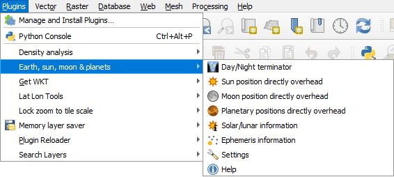
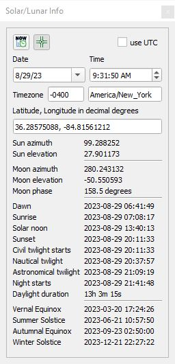
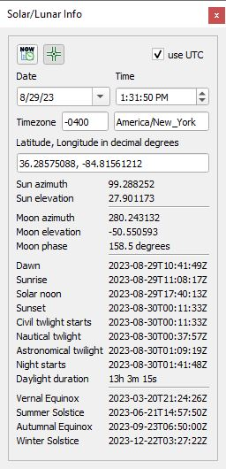

# Earth, Sun, Moon, and Planets Plugin

This plugin uses the highly accurate Skyfield library to show where the sun, moon, and planets are located at their zenith from earth's perspective for a particular date and time. An additional algorithm calculates lunar and solar data for a particular location on earth given a date and time. The ***Day/Night terminator*** algorithm plots the day/night terminator line and polygon layers associate with sunrise/set, civil twilight, nautical twilight, and astronomical twilight. When installed, this plugin can be found in the QGIS menu under ***Plugins->Earth, sun, moon &amp; planets***. 

## Installation
Other than for the ***Day/Night terminator*** algorithm, this plugin requires two additional libraries not provided by QGIS. These can be installed by opening up your OSGeo4W Shell and typing the command "**pip install timezonefinder skyfield**" or whatever method you use to install Python libraries.

You do not need to be a system administrator to be able to install these libraries.

## Tools Overview

These are the tools provided by the Earth, Sun, Moon, and Planets Plugin:

*  ***Day/Night terminator*** - This algorithm creates vector layers for the day/night terminator line, polygon layers associate with sunrise/set, civil twilight, nautical twilight and astronomical twilight, and the position of the sun directly overhead. Unlike the other algorithms below this does not depend on the Skyfield library. It uses spherical geometery like the web based maps that you find on-line.
*  ***Sun position directly overhead*** - This shows the location of the sun where it is directly overhead for a particular date and time.
*  ***Moon position directly overhead*** - This shows the location of the moon where it is directly overhead for a particular date and time.
*  ***Planetary positions directly overhead*** - This shows the location of the planets where they are directly overhead for a particular date and time.
*  ***Ephemeris information*** - This provides information about the selected ephemeris file. This plugin includes limited ephemeris data for the dates 1990-2040. For dates outside this range other ephemeris files can be downloaded from the <a href="https://naif.jpl.nasa.gov/pub/naif/generic_kernels/spk/planets/">JPL Ephemeris page</a>. These can be installed from the ***Settings*** menu.
*  ***Settings*** - Plugin settings.

As an example this is the dialog for the algorithm to calculate the sun directly overhead.

The moon and planets are the same. This shows what this algorithm produces when this algorithm is run.

This shows the locations of the sun, moon, and planets.

The attributes table contains the name of the object, its coordinate where it is directly overhead, and the date and time both in computer time and UTC. This is the attribute table with all three combined together.

##  Solar/lunar information

The user can click on the  coordinate capture icon and click on the map. This dialog is then populated with the following details. The timezone is automatically selected based on the coordinate.

The ***Now*** icon  will set the date and time to the current computer time. The ***Use UTC*** check box displays the date and times in UTC; otherwise, they are displayed using the selected time zone as follows.

##  Ephemeris Information
This tool displays information about the selected ephemeris file being used. Here is the limited extract file ***de440s_1990_2040.bsp*** that comes with the plugin.

##  Settings

This shows the settings dialog window. 

It allows the user to select the ephemeris file used in the calculations. Click on the drop down box to select the ephemeris file to use. When first installed the plugin only includes a single limited ephemeris data extract between the years 1990 and 2040 so there will only be one option. A full ephemeris file exceeds the allowed QGIS plugin size. For dates outside this range other ephemeris files can be downloaded from the <a href="https://naif.jpl.nasa.gov/pub/naif/generic_kernels/spk/planets/">JPL Ephemeris page</a>. Once one of these are downloaded, click on the "**...**" button and select the downloaded **.bsp** then click on the ***Install Ephemeris File*** button and it will be copied over to the plugin's data directory. It will also select the file automatically in the ephemeris drop down list. Click on ***OK*** to accept these settings.

These are some of the popular ephemeris series that you will find on the JPL Ephemeris page.

<table><tr><th>Issued</th><th>Short</th><th>Medium</th><th>Long</th></tr>
<tr><td>1997</td><td></td>
<td>de405.bsp 
1600 to 2200 
63 MB</td>
<td>de406.bsp 
−3000 to 3000 
287 MB</td>
</tr>
<tr><td>2008</td>
<td>de421.bsp 
1900 to 2050 
17 MB</td>
<td></td>
<td>de422.bsp 
−3000 to 3000 
623 MB</td>
</tr>
<tr><td>2013</td>
<td>de430_1850-2150.bsp 
1850 to 2150 
31 MB</td>
<td>de430t.bsp 
1550 to 2650 
128 MB</td>
<td>de431t.bsp 
–13200 to 17191 
3.5 GB</td>
</tr>
<tr><td>2020</td>
<td>de440s.bsp 
1849 to 2150 
32 MB</td>
<td>de440.bsp 
1550 to 2650 
114 MB</td>
<td>de441.bsp 
−13200 to 17191 
3.1 GB</td>
</tr>
</table>